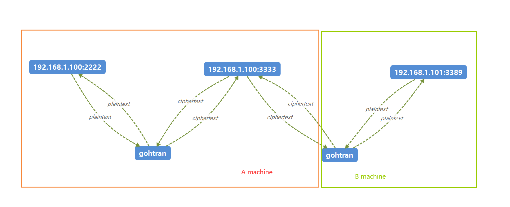

- [中文文档](./README_cn.md)

# gohtran
Golang version of the Htran tool

Provides aes and gzip encryption for compressed data transmission

## What can do
Connect different ports in series

## For example:
You want to connect from port 2222 on machine A to port 3389 on machine B, assuming that b's address is 192.168.1.100, you can do so

- `gohtran-tran 2222 192.168.1.100:3389`

Call up mstsc through win+R and enter the local address 127.0.0.1:2222 to connect to machine b for remote control of the computer

Same thing with linux

- `ssh -p 2222 username@127.0.0.1`

You can connect to 3389 on the machine 192.168.1.100 by connecting to port 2222 locally

## Installation
```bat
git clone git@github.com:7134g/gohtran.git
go build .
```

## Main functions
1. Listen for forwarding locally

By binding port 2222 on the local to port 3333 on the local, data written to port 2222 can be read from 3333 and vice versa
- `gohtran -listen 2222 3333`
2. Forward the data to a remote host

When you link to 127.0.0.1:2222, you actually access port 192.168.1.100:3306
- `gohtran -tran 2222 192.168.1.100:3306`
3. Reverse connection forwarding

Link the ports of machine A (192.168.1.101) and machine B (192.168.1.100) at the same time.
When other machines remotely link to port 2222 of machine A, they actually link to port 3389 of machine B
- `gohtran -slave 192.168.1.101:2222 192.168.1.100:3389`


According to the above functions, infinite series of all accessible machines can be realized

```text
+-----------------------------help information--------------------------------+
usage: "-listen port1 port2" #example: "gohtran -listen 8888 3389"
       "-tran port1 ip:port2" #example: "gohtran -tran 8888 1.1.1.1:3389"
       "-slave ip1:port1 ip2:port2" #example: "gohtran -slave 127.0.0.1:3389 1.1.1.1:8888"
       "-left The options are 1, 2, and 3
       "-right The options are 1, 2, and 3
       "-h program documentation
       "-s silent mode,no information is displayed
       "-log output transferred data to file
       
The value of 1 corresponds to aes encryption and decryption
The value of 2 corresponds to gzip compression and decompression
The value of 3 corresponds to the simultaneous use of aes and gzip
============================================================
If you see start transmit, that means the data channel is established

```


#### Points to Note
If aes encryption or gzip compression is enabled, you need to run at least two programs to encrypt and decryption properly

For example:

For example, if servers A and B exist, you want to connect to server B through 192.168.1.100:2222 of server A and encrypt the network transmission between the two servers.

1. Enable the listen mode on machine A (192.168.1.101)
- `gohtran -listen 2222 3333 -left aes`

2. Example Enable the slave mode on machine B (192.168.1.100)
- `gohtran -slave 192.168.1.100:3333 192.168.1.101:3389 -right aes`

3. If you access port 2222 on machine A, you can get the correct connection to machine B 3389
   

